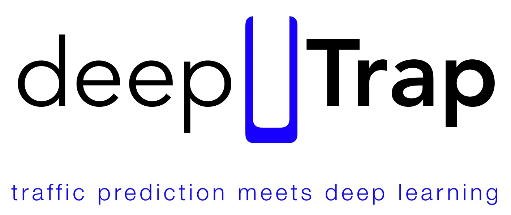

# ENBW Hackathon – All About Traffic

Traffic prediction using LSTMs for personalized Out-of-Home advertisement.

## Prerequisites

Packages needed to run the code, installed using ```pip install```:

```
pytorch
seaborn
pandas
numpy
matplotlib
```

Data used:
 - weather  https://cdc.dwd.de/portal/201810240858/searchview
 - tourism  http://www.statistik-bw.de/TourismGastgew/Tourismus/
 - traffic  provided by EnBW

## Running the prediction using .py-code in LSTM directory

The code can't be used directly. Traffic data provided by EnBW was used and stored for specific timeframe together with weather, tourism and other data.

## Authors

* **Arnold, Elias**
* **Blessing, Luca**
* **Dorkenwald, Michael**
* **Lüth, Carsten**
* **Ziegler, John**

## License

This project is licensed under the MIT License - see the [LICENSE.md](LICENSE.md) file for details
